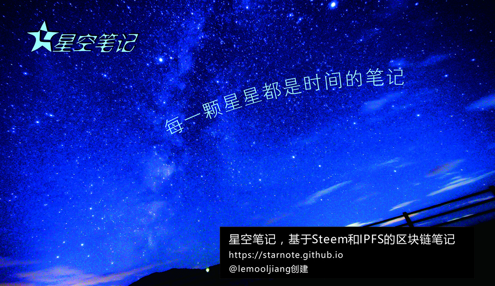

# 关于星空笔记

星空笔记，基于Steem和IPFS的区块链笔记，@lemooljiang创建。数据存储在Steem区块链上，图片存在IPFS网络中，前端则使用IndexedDB数据库，几者相结合，有着神奇的效果！

星空笔记是一个去中心的应用！ 它和比特币的离线钱包类似，可以很方便地在本地构建，无需服务器。

当然，为了方便大家使用，我把它上传到github page中，大家可以直接访问：https://starnote.github.io

## 本地构建说明
本地环境：Apache 或 Nginx

仓库地址： https://github.com/starnote/starnote.github.io

将仓库中的“index.html” 和 “css”等文件下载到本地，放进Apache 或 Nginx的根目录即可，http://localhost
